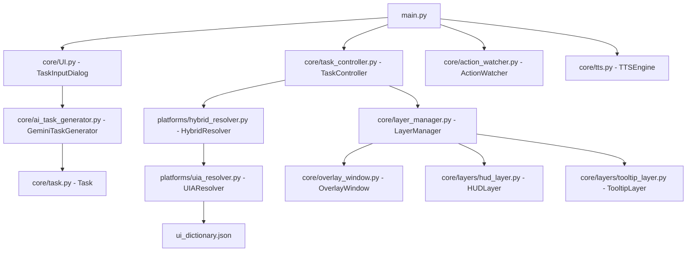

# AI Overlay Project Status & Information

This document outlines the current state, architecture, and developer information for the **AI Overlay** project.

---

## 📊 Current Status

- **Active Git Branch:** `feat/UIDictornary`
- **Working Directory Status:**
  - Branch is up-to-date with `origin/feat/UIDictornary`.
  - Unstaged modifications present in task configuration and history:
    - [tasks/generated_task.json](file:///c:/Users/parth/college-code/ai-overlay/Overlay/tasks/generated_task.json)
    - [tasks/history.json](file:///c:/Users/parth/college-code/ai-overlay/Overlay/tasks/history.json)

### 🕒 Recent Commits
| Commit Hash | Author | Date | Message |
| :--- | :--- | :--- | :--- |
| `e999e1f` | p4rth-rana314 | 2026-07-23 | feat: add generated task definition for creating Python files and update task history log |
| `b9954e7` | p4rth-rana314 | 2026-07-22 | added error handling in `ele_not_found` |
| `0cbcd34` | p4rth-rana314 | 2026-07-22 | created ui-dictionary for faster fetch (`ui_dictionary.json`) |
| `e0041d2` | p4rth-rana314 | 2026-07-22 | clean slate with corrected dependencies for Python 3.13 |
| `0130899` | Bhavin Prajapati | 2026-05-05 | Added the mic and speech feature |

---

## ⚙️ Project Overview

The **AI Overlay** is a desktop assistance application that uses a transparent, interactive PyQt6 overlay window to guide users through multi-step computer tasks. By dimming the rest of the screen and painting a spotlight highlight over specific UI controls, it provides visually rich tutorials on-the-fly.

### Core Features
1. **Gemini Task Decomposer:** Converts free-text task requests into structured step definitions using the `gemini-2.5-flash` model.
2. **Hybrid Coordinate Resolution:** Resolves element screen coordinates dynamically at runtime using Windows UI Automation (via `pywinauto`) and falls back to cached mappings when appropriate.
3. **Step Navigation HUD:** An overlay panel providing back/next controls, step progress indicators, pause capability, and random-access step dot navigation.
4. **Action Watcher:** Listens for mouse/focus events in target bounding regions to automatically advance steps once the user performs the action.
5. **Multi-Sensory Guidance:** Integrates Text-to-Speech (TTS) using Windows SAPI to speak step instructions, and supports microphone input for hands-free queries.
6. **Polished UI/UX:** Built with PyQt6 animations, step-complete indicator flashes, and a celebratory completion toast when the entire task sequence is finished.

---

## 🏗️ Architecture & Core Components



### 📂 Key Directory & File Map

* **Entry Point:**
  - [main.py](file:///c:/Users/parth/college-code/ai-overlay/Overlay/main.py): Sets up the application loop, signals, shortcuts, and orchestrates the controller, HUD, watchers, and TTS engines.

* **Core Logic (`core/`):**
  - [core/task_controller.py](file:///c:/Users/parth/college-code/ai-overlay/Overlay/core/task_controller.py): Manages current step index, invokes the coordinate resolver, and controls the navigation flow.
  - [core/ai_task_generator.py](file:///c:/Users/parth/college-code/ai-overlay/Overlay/core/ai_task_generator.py): System prompts and call sequence for the Gemini API (`gemini-2.5-flash`) to generate structured steps.
  - [core/overlay_window.py](file:///c:/Users/parth/college-code/ai-overlay/Overlay/core/overlay_window.py): A transparent canvas overlaying the desktop screens to draw dark dimming masks and clear spotlight shapes.
  - [core/layer_manager.py](file:///c:/Users/parth/college-code/ai-overlay/Overlay/core/layer_manager.py): Integrates layers, controls rendering cycles, and manages status-flash animations.
  - [core/layers/hud_layer.py](file:///c:/Users/parth/college-code/ai-overlay/Overlay/core/layers/hud_layer.py): Draws the overlay controller with step dots, navigation controls, and pause toggles.
  - [core/layers/tooltip_layer.py](file:///c:/Users/parth/college-code/ai-overlay/Overlay/core/layers/tooltip_layer.py): Draws pointers pointing at spotlights, containing step descriptions and expandable explanations.
  - [core/action_watcher.py](file:///c:/Users/parth/college-code/ai-overlay/Overlay/core/action_watcher.py): Utilizes system hooks and accessibility events to auto-advance tasks when the targeted control is clicked.
  - [core/tts.py](file:///c:/Users/parth/college-code/ai-overlay/Overlay/core/tts.py): Implements Windows SAPI TTS voice synthesis to announce instructions.
  - [core/step.py](file:///c:/Users/parth/college-code/ai-overlay/Overlay/core/step.py) & [core/task.py](file:///c:/Users/parth/college-code/ai-overlay/Overlay/core/task.py): Structured dataclasses for step and task parsing.

* **Platform Resolution (`platforms/`):**
  - [platforms/hybrid_resolver.py](file:///c:/Users/parth/college-code/ai-overlay/Overlay/platforms/hybrid_resolver.py): Directs resolution requests to UIA. (Note: Gemini Vision fallback is currently disabled).
  - [platforms/uia_resolver.py](file:///c:/Users/parth/college-code/ai-overlay/Overlay/platforms/uia_resolver.py): Locates elements inside native Windows application window trees using `pywinauto` via the UIA backend.
  - [platforms/atspy_resolver.py](file:///c:/Users/parth/college-code/ai-overlay/Overlay/platforms/atspy_resolver.py): The Linux accessibility alternative wrapper for ATSPI.

* **Dictionaries & Tasks:**
  - [ui_dictionary.json](file:///c:/Users/parth/college-code/ai-overlay/Overlay/ui_dictionary.json): Fast cached lookup mappings mapping app elements (e.g. Word, Excel) to their expected `control_type`, `title`, and `path_hint` for quick locator resolution.
  - [tasks/](file:///c:/Users/parth/college-code/ai-overlay/Overlay/tasks): Contains pre-defined or generated JSON tasks and task histories.

---

## 🛠️ Stack & Dependencies

The project is configured for **Python 3.13** compatibility on Windows. Key dependencies specified in [requirements.txt](file:///c:/Users/parth/college-code/ai-overlay/Overlay/requirements.txt):

* **UI Framework:** PyQt6 (version `6.7.0`)
* **AI Integration:** `google-generativeai` (version `0.7.2`)
* **Accessibility / Automation Backend:** `pywinauto` (version `0.6.8` for Windows UIA lookup)
* **Screen Utilities:** `screeninfo`, `mss`, `Pillow`
* **Others:** `keyboard` (hotkeys), `python-dotenv` (environment variables)

---

## 🚀 Running and Testing the App

### Environment Setup
1. Create a virtual environment (`.venv`) and install dependencies:
   ```powershell
   python -m venv .venv
   .venv\Scripts\activate
   pip install -r requirements.txt
   ```
2. Set your Gemini API key in a `.env` file in the root directory:
   ```env
   GEMINI_API_KEY=your-api-key-here
   ```

### Execution
* Run the main app:
  ```powershell
  python main.py
  ```
* Run a quick local UIA/Vision hybrid smoke-test (ensure Notepad is open first):
  ```powershell
  python test_hybrid.py
  ```
